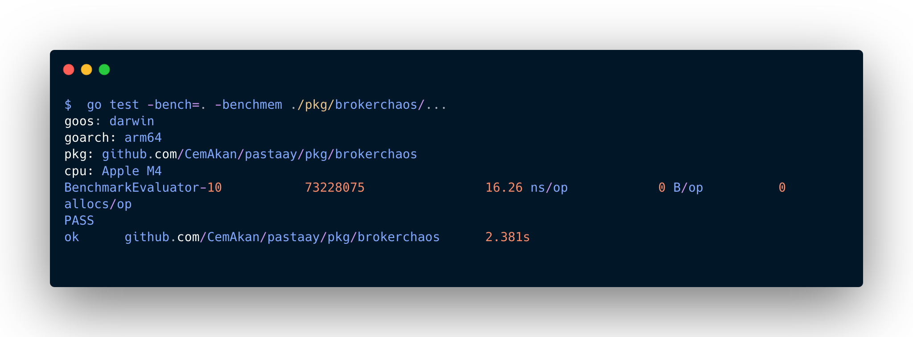

<p align="center">
  
  <br>
  
</p>

<p align="center">
  
  
  
</p>

## Core Features

*   **Universal Chaos:** Kafka, RabbitMQ, HTTP, gRPC, SQL, MongoDB, and Redis support.
*   **Security Hardened:** Native protection against multi-slash URL bypasses and SQL delimiter evasion.
*   **Deterministic Cascading:** Complex gRPC stream rules that don't short-circuit.
*   **Standardized Metrics:** Single-source-of-truth monitoring with `protocol:target` labeling.
*   **Resource Sabotage:** Simulate CPU starvation and memory leaks with guaranteed cleanup via the Amnesia Protocol.
*   **Distributed Tracing:** Zero-allocation OpenTelemetry (OTLP) integration for visualizing chaos events across microservices without goroutine leaks.

---

## Hot-Reloading

Pastaay is built to be reactive. The following demonstration shows the engine's **amnesia-proof hot-reload** capability via our built-in TUI visualizer. Watch as it detects manual updates to `pastaay.yaml` and instantly transitions between stable, high-latency (Glitch), and disconnected (Void) states without dropping the underlying connection or requiring a service restart.

<p align="center">
  
</p>

> **Reactivity:** The engine reacts to `latency_chance` and `error_chance` updates within milliseconds of the file being saved.

---

## Distributed Tracing (OpenTelemetry)

Pastaay features zero-allocation distributed tracing out-of-the-box. It automatically injects high-fidelity spans into your active context during a chaos event, providing granular visibility into exactly *where*, *when*, and *how* your system was disrupted.

To enable tracing, configure the following environment variable on your host application:

| Environment Variable | Description | Example |
| :--- | :--- | :--- |
| `OTEL_EXPORTER_OTLP_ENDPOINT` | The gRPC endpoint of your OTel Collector. If left empty, tracing safely defaults to a zero-overhead `No-Op` mode. | `http://otel-collector:4317` |

### The Zero-Overhead Guarantee
Pastaay utilizes OpenTelemetry's `BatchSpanProcessor`. This means chaos spans are flushed asynchronously. Even if your tracing backend (like Jaeger or Zipkin) goes offline, experiences severe latency, or is overwhelmed by trace volume, Pastaay will **never block your application's critical path** or leak goroutines.

### Inspecting Chaos in Jaeger
When inspecting traces in Jaeger, look for spans generated by the `pastaay-engine` service. Clicking on a chaos span reveals specific tags that define the fault:
* `pastaay.target`: The exact endpoint, query, or topic affected (e.g., `/api/v1/ping`).
* `pastaay.fault_type`: The nature of the injected fault (e.g., `latency`, `error`, `drop`).

---

## Zero Allocation 

Pastaay is built to survive high-throughput data streams. Our core evaluator guarantees **O(1)** policy lookups and **0 Bytes** of memory allocation per operation, ensuring your application never suffers from Garbage Collection (GC) spikes.

<p align="center">
  
</p>

---

## Changelog

| Version         | Highlights                                                                                                                                                                                                                                  | Impact |
|:----------------|:--------------------------------------------------------------------------------------------------------------------------------------------------------------------------------------------------------------------------------------------| :--- |
| **v1.8.0** | **Advanced Observability:** Distributed Tracing via OpenTelemetry. Non-blocking span injection for HTTP, gRPC, SQL, NoSQL, and Message Brokers. | Maps chaos events to microservice traces in real-time. Identifies exact fault injection points in waterfall graphs (Jaeger/Zipkin) with zero performance overhead. |
| **v1.7**        | **Resource Sabotage:** CPU Stressors and RAM Bloaters to simulate memory leaks and compute starvation. |Identifies critical failure points during hardware pressure; verifies resource limit efficiency and ensures zero-footprint recovery via Amnesia Protocol.   |
| **v1.6.0**      | **Message Brokers:** Kafka & RabbitMQ Interceptors. **Hardened Standard**: Unified `protocol:target` labels and Triple-slash evasion protection. Mongo Abort: Synchronous execution blocking.                                                 | Eliminates observability fragmentation and ensures zero-bypass security for ignore lists in high-throughput distributed systems.|
| **v1.5.x**      | **Smart Mode:** Warmup Shield & DDL Ignorer.<br>**Amnesia-Proof Watcher:** Fixes Linux file-save detachment bugs.<br>**Double-Chaos Shield:** Guards against Go standard library fallbacks.<br>**Network Sabotage:** TCP `drop_connection`. | Achieves absolute structural perfection. Zero memory leaks, zero silent bypasses, and 100% accurate policy targeting in production. |
| **v1.0 - v1.4** | HTTP Middleware, Redis Hooks, gRPC Interceptors, SQL Driver Wrapper, YAML Hot-Reloading, and Native Metrics.                                                                                                                                | Established the core chaos engine architecture, baseline protocols, and native observability. |

<br>

---

## Documentation

Dive deep into Pastaay's mechanics using our official documentation:
* [The Configuration Guide](docs/configuration.md) - Learn how to write policies, target endpoints, and control the blast radius.
* [Architecture & Engine](docs/architecture.md) - Understand how the Policy Engine achieves zero-latency lookups, and how we solved deep OS/Compiler integration bugs.

---

##  Installation

```bash
go get github.com/CemAkan/pastaay
```

---

## Quick Start

### 1. Create a Configuration File (`pastaay.yaml`):

```yaml
version: 1
warmup_duration: "10s"
enable_default_ignored: true

policies:
  - name: "custom-http-failure"
    target: "/api/hello"
    type: "http"
    error_chance: 1.0
    error_code: 429
    error_body: '{"error": "Pastaay Chaos: Rate Limit Exceeded"}'

  - name: "mongo-kill-switch"
    target: "all"
    type: "mongo"
    drop_connection: true
```

### 2. Integrate into your Go application:

```go
package main

import (
    "net/http"
    "github.com/CemAkan/pastaay/pkg/config"
    "github.com/CemAkan/pastaay/pkg/ritual"
    "github.com/CemAkan/pastaay/pkg/metrics"
)

func main() {
    // Load config & enable amnesia-proof hot-reload
    cfg, _ := config.LoadConfig("pastaay.yaml")
    cfgManager := config.NewManager(cfg)
    config.WatchConfig("pastaay.yaml", cfgManager.Update)

    // Start Prometheus metrics server
    go metrics.StartServer(":2112")

    // Setup your standard router
    mux := http.NewServeMux()
    mux.HandleFunc("/api/hello", func(w http.ResponseWriter, r *http.Request) {
       w.Write([]byte("Hello, World!"))
    })

    // Wrap with Pastaay Chaos Middleware
    chaosHandler := ritual.Middleware(cfgManager)(mux)
    http.ListenAndServe(":8080", chaosHandler)
}
```

---

## Running the Demos

Pastaay ships with two distinct examples to help you understand both its integration mechanics and its real-time reactivity.
1. The Integration Demo
   A complete, hardened microservice stack (URL Shortener API, PostgreSQL, Redis, MongoDB, Kafka, RabbitMQ) showing how to securely integrate Pastaay without race conditions.

```bash
   cd examples/demo
   docker compose up -d --build
   docker compose logs -f app
```


* **API:** `http://localhost:8080`
* **Metrics:** `http://localhost:2112/metrics`
* **Prometheus UI:** `http://localhost:9090`
* **Grafana:** `http://localhost:3000`

<br>

2. The TUI Visualizer (Vortex)
   A standalone terminal user interface built to demonstrate Pastaay's amnesia-proof hot-reloading. This is the source of the GIF shown above.
   cd examples/visualizer

> **Note**: Use 'run' instead of 'up' to ensure a clean TTY for the visualizer
docker compose run --rm --service-ports app

---

## Roadmap:

Pastaay is rapidly evolving into a full-fledged enterprise chaos engineering suite. Here is our aggressive roadmap for the upcoming major releases:

| Version | Planned Features | Status   |
| :--- | :--- |:---------|
| **v1.9** | **Cloud & Low-Level:** AWS Fault Injection Simulator (FIS) hooking and eBPF-based packet dropping without code changes. | In Progress |
| **v2.0** | **The Enterprise Suite:** Kubernetes Operator (`pastaay-operator` via CRDs), CLI Tool (`pastaay-cli`), and a real-time Web Dashboard UI. | Planned  |

<br>

---

##  Contributing

Contributions from the community are always welcome <3 Whether you are looking to build a new protocol interceptor, patch a core bug, or refine the documentation, your input is highly valued.

Please read the [Contributing Guide](CONTRIBUTING.md) for detailed instructions on the development workflow, core architectural guidelines (including pointer safety and interceptor fallbacks), and how to submit a Pull Request.

---

##  License

Pastaay is open-sourced software licensed under the [MIT License](LICENSE).

---

<p align="center">
  
</p>

