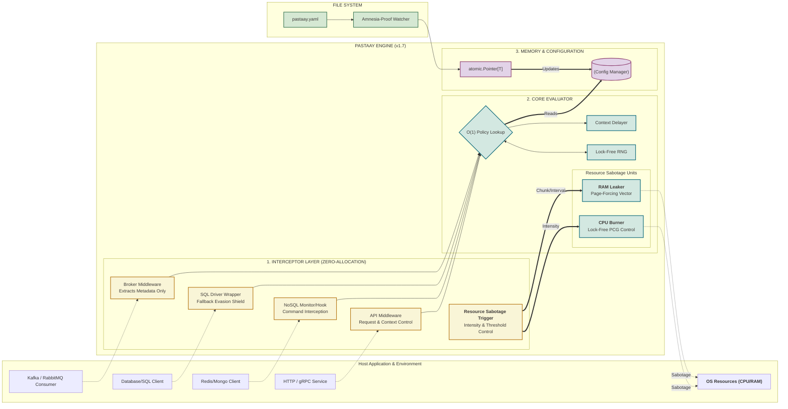

  

Welcome to the engine room of Pastaay. This document explains the core design decisions, memory management, and the deep OS/Compiler integrations that allow the Chaos Engine to inject faults reliably into high-throughput microservices without becoming a bottleneck.

---

## Architecture Flow

Before diving into the low-level memory operations and interceptor mechanics, here is the macro view of how Pastaay's components interact to maintain zero-allocation overhead.

  

---

## 1. The Policy Engine & Security Shield

### Atomic Map Swap & Deterministic Logic
Instead of evaluating the YAML file on every request, the `config.Manager` pre-computes routing maps. It now includes a **Deterministic Hash Engine** using a sorted PCG (Permuted Congruential Generator) to ensure stateful protocols like gRPC streams maintain consistency across the entire session.

### The Security Evasion Shield
Pastaay includes a multi-layered security shield to prevent chaos bypasses:
*   **Triple-Slash Evasion:** The engine natively handles and normalizes multiple leading slashes (e.g., `////api/v1`) using aggressive path stripping, ensuring `ignored_commands` cannot be bypassed by malformed URLs.
*   **SQL Delimiter Aggression:** The SQL cleaner now strips all standard SQL delimiters including `()`, `;`, and trailing whitespaces. A query like `(SELECT 1);` will be correctly identified as `SELECT 1` for ignore-list matching.

### Thread-Safe Evaluation & Lock-Free RNG
To support high-throughput streams (like Kafka), Pastaay isolates the Random Number Generator natively. It uses Go's native, lock-free PCG (Permuted Congruential Generator) RNG engine from `math/rand/v2`. This completely eliminates the need for `sync.Mutex` locking, preventing the fatal race conditions and bottlenecks that occur when thousands of concurrent goroutines attempt to generate chaos events simultaneously, ensuring thread-safety with absolute zero latency.

### Engine Internals

---

## 2. Infrastructure Hooks & Interceptor Architecture

Pastaay uses the **Decorator/Wrapper Pattern** to inject chaos at the lowest possible boundaries.

### 2.1 Message Brokers (Kafka & RabbitMQ): The Zero-Allocation Shield
Injecting chaos into event streams requires extreme care regarding Garbage Collection (GC).
* **Zero-Payload Memory:** Pastaay's interceptors purposefully ignore the message body (`msg.Value` or `delivery.Body`). Copying megabytes of payload data into memory to evaluate chaos would cause massive OOM (Out of Memory) crashes. Pastaay only extracts lightweight metadata (Topic/RoutingKey and Headers).

* **Context-Aware Delays:** Pastaay never uses unconditional `time.Sleep()` for latency injection. It uses context-aware `select` channels. If the host application initiates a Graceful Shutdown, the chaos delay aborts instantly, preventing zombie goroutines from hanging the shutdown sequence.

* **Strict Type Safety:** AMQP (RabbitMQ) headers are weakly typed (`interface{}`). Pastaay enforces strict string assertions during header extraction, ensuring that an unexpected integer header never causes a Go runtime panic.

### 2.2 SQL Chaos: Avoiding The "Double-Chaos" Trap
Pastaay registers a custom driver (`sqlchaos.Register`) and implements the standard `database/sql/driver` interfaces.
**The Fallback Evasion Shield:** The Go `database/sql` library heavily relies on interface fallbacks. Pastaay natively detects these compiler fallbacks at runtime. By selectively suppressing chaos in `Prepare` interfaces and enforcing it directly on `Context` execution interfaces, Pastaay completely eradicates the "Double-Chaos" trap.

### 2.3 Redis Pipelines: Pointer Memory Traps
Injecting errors into a batch of pipelined Redis commands introduces significant slice memory challenges. Modifying a command via a traditional `for _, cmd := range cmds` loop creates a temporary copy, causing the error injection to silently vanish. Pastaay uses strict memory indexing (`cmds[i]`) and enforces a pre-execution chronological delay to guarantee that latency is applied *before* the physical wire message is sent.

### 2.4 MongoDB & Synchronous Blocking
Unlike SQL, MongoDB's monitor hook does not allow returning a direct error. To simulate a hard fault:
*   **Synchronous Execution Kill:** Pastaay blocks the `Started` hook until the caller's context is canceled. This forces the driver to timeout or return a `context canceled` error to the application, providing a realistic "Abort" simulation at the wire level.
---

## 3. Amnesia-Proof Daemon (Fault Tolerance)

Hot-reloading a config file on Linux using standard tools (`Vim`, `Nano`, or `CI/CD`) doesn't simply "write" to a file. It creates a temporary file, deletes the original, and renames the temp file (atomic save).

Naive `fsnotify` watchers go permanently blind when the original inode is deleted.
**Pastaay's Amnesia-Proofing:**
1. Pastaay natively traps `Rename/Remove` filesystem events.
2. It engages an asynchronous retry loop to forcibly re-attach to the new file inode.
3. It manually triggers a `reloadCallback` to prevent skipped write events from desyncing the policy memory.

Furthermore, strict YAML validation ensures that corrupted configurations trigger an **Atomic Rollback**, maintaining the last-known-good state.

---

## 4. Standardized Observability (Prometheus)

To ensure high-fidelity Grafana dashboards, Pastaay v1.6.2 enforces a **Standardized Labeling Convention**:
*   **Format:** `protocol:target` (e.g., `sql:all`, `kafka:orders.events`, `grpc:/Service/Method`).
*   **Unified Tracking:** All faults (latency, drop, error) now use these consistent tags across all 7 supported protocols, eliminating data fragmentation in multi-protocol environments.ected, Pastaay increments the counter using atomic memory operations (`sync/atomic.AddUint64`), which execute at the hardware level in sub-nanoseconds. This means observability is entirely non-blocking and lock-free.

## 5. OS-Level Resource Sabotage (v1.7)
Low-level resource exhaustion that bypasses standard OS and Compiler optimizations:
* **Demand Paging Evasion:** Standard allocations are lazy. Pastaay forces physical RAM allocation by writing to every 4KB page boundary, bypassing kernel-level optimizations.
* **Amnesia Protocol:** To ensure zero-footprint, resource goroutines use local pools. Upon context cancellation, pointers are nulled and `runtime.GC()` is invoked for immediate reclamation.
* **Lock-Free CPU Stress:** Uses a tight loop with a configurable `throttle_threshold` for consistent stress without context-switching overhead.