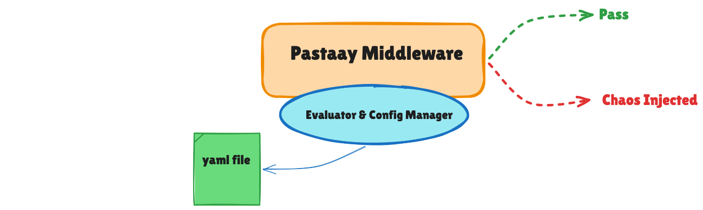

  

Welcome to the engine room of Pastaay. This document explains the core design decisions, memory management, and the deep OS/Compiler integrations that allow the Chaos Engine to inject faults reliably into high-throughput microservices without becoming a bottleneck.

---

## Architecture Flow

Before diving into the low-level memory operations and interceptor mechanics, here is the macro view of how Pastaay's components interact to maintain zero-allocation overhead.

  

---

## 1. The Policy Engine & Concurrency

The biggest challenge in Chaos Engineering is ensuring the tool itself doesn't crash the host application.

### The Atomic Map Swap
Instead of evaluating the YAML file on every request, the `config.Manager` acts as an ultra-fast, thread-safe memory cache. It pre-computes a routing map: `map[string][]Policy`.
When an interceptor asks for policies, it performs an `O(1)` map lookup.

### Thread-Safe Evaluation & Lock-Free RNG
To support high-throughput streams (like Kafka), Pastaay isolates the Random Number Generator natively. It uses Go's native, lock-free PCG (Permuted Congruential Generator) RNG engine from `math/rand/v2`. This completely eliminates the need for `sync.Mutex` locking, preventing the fatal race conditions and bottlenecks that occur when thousands of concurrent goroutines attempt to generate chaos events simultaneously, ensuring thread-safety with absolute zero latency.

### Engine Internals

```mermaid
graph TD
    subgraph "Host Application"
        A["Kafka / RabbitMQ Consumer"]
        B["Database/SQL Client"]
        C["Redis/Mongo Client"]
        D["HTTP / gRPC Service"]
    end

subgraph PE [" "]
direction TB
L1["<b>PASTAAY ENGINE</b>"]

subgraph IL [" "]
direction TB
L2["<b>1. INTERCEPTOR LAYER (ZERO-ALLOCATION)</b>"]
I1["Broker Middleware<br/>Extracts Metadata Only"]
I2["SQL Driver Wrapper<br/>Fallback Evasion Shield"]
I3["Mongo Monitor / Redis Hook<br/>Command Interception"]
I4["API Middleware<br/>Request & Context Control"]
end

subgraph CE [" "]
direction TB
L3["<b>2. CORE EVALUATOR</b>"]
E1{"O(1) Policy Lookup"}
E2["Lock-Free RNG<br/>Eliminates Global Locking"]
E3["Context-Aware Delayer<br/>Graceful Shutdown Safe"]
end

subgraph MC [" "]
direction TB
L4["<b>3. MEMORY & CONFIGURATION</b>"]
M1[("(Config Manager)")]
M2["sync.RWMutex<br/>Atomic Map Swap"]
end
end

subgraph FS [" "]
direction TB
L5["<b>FILE SYSTEM</b>"]
F1["pastaay.yaml"]
F2["Amnesia-Proof Watcher<br/>fsnotify + Retry Loop"]
end

%% Connections
A -.->|Headers/Topic| I1
B -.->|Query Context| I2
C -.->|Command Target| I3
D -.->|Path / Method| I4

I1 --> E1
I2 --> E1
I3 --> E1
I4 --> E1

E1 <--> E2
E1 --> E3
E1 ==>|Reads Cache| M1

F1 -->|File Save/Replace| F2
F2 -->|Hot Reload Trigger| M2
M2 ==>|Updates Cache| M1


classDef interceptor fill:#f9f5d7,stroke:#b57614,stroke-width:2px,color:#3c3836;
classDef evaluator fill:#d3e8e1,stroke:#076678,stroke-width:2px,color:#3c3836;
classDef memory fill:#e2d3e8,stroke:#8f3f71,stroke-width:2px,color:#3c3836;
classDef filesystem fill:#d5e8d3,stroke:#427b58,stroke-width:2px,color:#3c3836;
classDef header fill:none,stroke:none,font-size:14px,font-weight:bold;

class I1,I2,I3,I4 interceptor;
class E1,E2,E3 evaluator;
class M1,M2 memory;
class F1,F2 filesystem;
class L1,L2,L3,L4,L5 header;
```

---

## 2. Infrastructure Hooks & Interceptor Architecture

Pastaay uses the **Decorator/Wrapper Pattern** to inject chaos at the lowest possible boundaries.

### 2.1 Message Brokers (Kafka & RabbitMQ): The Zero-Allocation Shield
Injecting chaos into event streams requires extreme care regarding Garbage Collection (GC).
* **Zero-Payload Memory:** Pastaay's interceptors purposefully ignore the message body (`msg.Value` or `delivery.Body`). Copying megabytes of payload data into memory to evaluate chaos would cause massive OOM (Out of Memory) crashes. Pastaay only extracts lightweight metadata (Topic/RoutingKey and Headers).

* **Context-Aware Delays:** Pastaay never uses unconditional `time.Sleep()` for latency injection. It uses context-aware `select` channels. If the host application initiates a Graceful Shutdown, the chaos delay aborts instantly, preventing zombie goroutines from hanging the shutdown sequence.

* **Strict Type Safety:** AMQP (RabbitMQ) headers are weakly typed (`interface{}`). Pastaay enforces strict string assertions during header extraction, ensuring that an unexpected integer header never causes a Go runtime panic.

### 2.2 SQL Chaos: Avoiding The "Double-Chaos" Trap
Pastaay registers a custom driver (`sqlchaos.Register`) and implements the standard `database/sql/driver` interfaces.
**The Fallback Evasion Shield:** The Go `database/sql` library heavily relies on interface fallbacks. Pastaay natively detects these compiler fallbacks at runtime. By selectively suppressing chaos in `Prepare` interfaces and enforcing it directly on `Context` execution interfaces, Pastaay completely eradicates the "Double-Chaos" trap.

### 2.3 Redis Pipelines: Pointer Memory Traps
Injecting errors into a batch of pipelined Redis commands introduces significant slice memory challenges. Modifying a command via a traditional `for _, cmd := range cmds` loop creates a temporary copy, causing the error injection to silently vanish. Pastaay uses strict memory indexing (`cmds[i]`) and enforces a pre-execution chronological delay to guarantee that latency is applied *before* the physical wire message is sent.

### 2.4 MongoDB & TCP Nuclear Locks
Unlike SQL, Pastaay injects an `event.CommandMonitor` directly into MongoDB's native Driver (v2).
For network sabotages (`drop_connection`), Pastaay hijacks the underlying `net.Dialer`. **Safeguard:** Dropping a physical TCP connection is catastrophic. Pastaay enforces a strict "Nuclear Lock", ensuring that TCP Drops can only be executed if the user explicitly targets `"all"` or `"database"`.

---

## 3. Amnesia-Proof Daemon (Fault Tolerance)

Hot-reloading a config file on Linux using standard tools (`Vim`, `Nano`, or `CI/CD`) doesn't simply "write" to a file. It creates a temporary file, deletes the original, and renames the temp file (atomic save).

Naive `fsnotify` watchers go permanently blind when the original inode is deleted.
**Pastaay's Amnesia-Proofing:**
1. Pastaay natively traps `Rename/Remove` filesystem events.
2. It engages an asynchronous retry loop to forcibly re-attach to the new file inode.
3. It manually triggers a `reloadCallback` to prevent skipped write events from desyncing the policy memory.

Furthermore, strict YAML validation ensures that corrupted configurations trigger an **Atomic Rollback**, maintaining the last-known-good state.

---

## 4. The Observability Pipeline (Prometheus)

Pastaay includes native Prometheus instrumentation (`pastaay_injected_faults_total`).
When a fault is injected, Pastaay increments the counter using atomic memory operations (`sync/atomic.AddUint64`), which execute at the hardware level in sub-nanoseconds. This means observability is entirely non-blocking and lock-free.