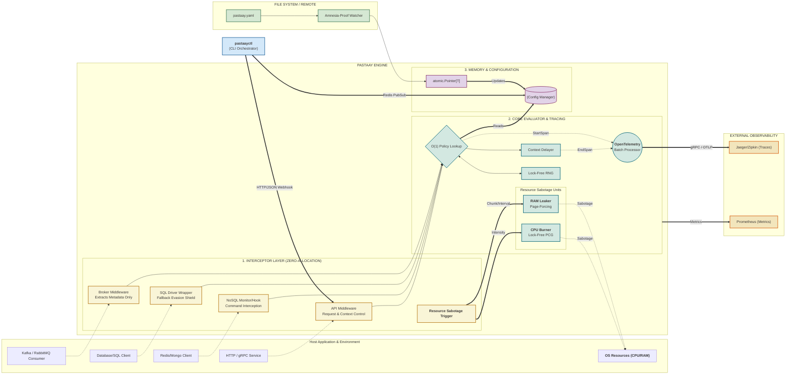

  

Welcome to the engine room. This document outlines the core design decisions, memory management strategies, and deep OS/compiler integrations that allow the chaos engine to inject faults into high-throughput microservices without becoming a bottleneck.

---

## Architecture Flow

Pastaay is engineered for **zero-allocation overhead**. The following diagram illustrates how the components interact to perform non-blocking chaos evaluation across the stack.

---

## 1. Core Policy Logic & Security Guards

### Atomic Map Swap & Deterministic Evaluation

To avoid re-parsing YAML on every request, the `config.Manager` pre-computes routing maps. It utilizes a **Deterministic Hash Engine** to ensure that stateful protocols, like gRPC streams, maintain consistency throughout their session lifecycle even during hot-reloads.

### Security Evasion Shields

The engine includes multiple normalization layers to prevent chaos bypasses:

* **Slash Normalization:** Aggressively strips multiple leading slashes (e.g., `////api/v1` becomes `api/v1`), ensuring ignored commands cannot be bypassed by malformed URLs.
* **SQL Delimiter Stripping:** Cleans standard SQL delimiters like `()`, `;`, and trailing whitespace. A query like `(SELECT 1);` is correctly identified for ignore-list matching.

### Thread-Safe Evaluation & Lock-Free RNG

To support massive throughput, Pastaay uses Go's native, lock-free **Permuted Congruential Generator (PCG)** from `math/rand/v2`. This eliminates `sync.Mutex` bottlenecks during random number generation across thousands of concurrent goroutines.

### Metric Cardinality Protection
The engine implements a **high-entropy label guard** within the `Manager.Update` lifecycle. All `MetricTag` labels are strictly truncated to 64 characters. This prevents "Prometheus RAM Explosion" in production environments if a user provides dynamic or excessively long strings (e.g., raw SQL queries) as chaos targets.

---

## 2. Infrastructure Interceptors

### Message Brokers (Kafka & RabbitMQ)

* **Zero-Payload Strategy:** Interceptors ignore message bodies to avoid OOM crashes on megabyte-scale payloads. Only lightweight metadata (Topic/RoutingKey and Headers) is evaluated.
* **Context-Aware Delays:** Instead of `time.Sleep()`, the engine uses context-aware `select` blocks. If the host application initiates a shutdown, chaos delays abort instantly.

### SQL & NoSQL Drivers

* **The Fallback Shield:** Detects Go's `database/sql` internal interface fallbacks. By suppressing chaos in `Prepare` and enforcing it in `Context` execution, Pastaay avoids the "Double-Chaos" trap where a single query triggers faults multiple times.
* **Redis Pipeline Safety:** Ensures synthetic errors are injected using index-based slice mutations (`cmds[i]`) rather than value-copy loops, preventing synthetic errors from disappearing due to memory pointer mismatches.
* **Synchronous Mongo Blocking:** Since MongoDB's monitor hook doesn't support direct error returns, Pastaay blocks the execution hook until the caller's context is cancelled, effectively simulating a wire-level abort.

---

## 3. Reliability & Integrity

### Amnesia-Proof Watcher

When dynamically reloading configs, standard editors often delete the original file inode. Pastaay's watcher natively traps `Rename/Remove` events and engages an asynchronous retry loop to re-attach to the new inode instantly.

### Multi-Phase Validation (The Nihilist Guard)

Remote and local payloads are subjected to strict validation before mutating engine memory:

* **Safety Bounds:** Rejects `latency_duration` exceeding 60s and `ram_chunk_mb` exceeding 4096MB.
* **Atomic Rollback:** If any rule in a batch fails validation, the entire update is rejected using `errors.Join`, maintaining the last-known-good state.

### Remote Sensor Hardening
* **Kubernetes Watcher:** Implements a **5MB bounded JSON stream decoder**. By bypassing `io.ReadAll`, the engine prevents OOM (Out of Memory) spikes during massive ConfigMap rotations in large Kubernetes fleets.
* **Redis Telemetry (Robust ACKs):** Asynchronous acknowledgments utilize `context.WithoutCancel(ctx)`. This ensures that even during a process `SIGTERM` shutdown, the final "Applied" signal has a 2-second grace period to reach the control plane before the TCP connection is severed.

---

## 4. Resource Sabotage Units

Pastaay manipulates the host environment using low-level stressors with guaranteed cleanup:

* **Demand Paging Evasion:** Standard RAM allocations are lazy. Pastaay forces physical allocation by writing to every 4KB page boundary.
* **Amnesia Protocol:** Resource goroutines use local pools. Upon context cancellation, pointers are nulled and `runtime.GC()` is manually invoked for immediate memory reclamation.

---

## 5. Observability & Tracing

### Standardized Labeling

All faults are reported to Prometheus using a standardized `protocol:target` labeling convention (e.g., `sql:database`, `grpc:/pb.Svc/Method`). This prevents data fragmentation in multi-protocol dashboards.

### Distributed Tracing (OpenTelemetry)

Pastaay features native, zero-allocation tracing via OpenTelemetry.

* **Asynchronous Telemetry:** Utilizes a `BatchSpanProcessor` to flush spans asynchronously via gRPC.
* **Resiliency:** If the OTel Collector is unreachable, spans are dropped silently. The tracing pipeline will never block the application's critical path or leak goroutines.

---

## 6. The Control Plane (pastaayctl)

Pastaay includes a senior-grade CLI designed to act as a centralized **Kinetic Control Plane**. It manages the lifecycle of chaos from offensive strikes to post-mortem analysis:

* **Imperative Strikes:** Bypasses YAML overhead for rapid testing via direct flags.
* **SLA-Guarded Automation:** Wraps fault injections in active feedback loops, triggering **Atomic Rollbacks** if latency thresholds or HTTP 5xx errors are detected.
* **Strategic Planning:** Includes a policy linter and blast radius forecaster to calculate a **Weighted Risk Score** before execution.

---

### Appendix: OpenTelemetry Span Reference

Pastaay generates specific span names based on the protocol and the type of fault injected. You can search for these exact span names in your tracing UI (Jaeger/Zipkin):

**HTTP & gRPC:**

* `pastaay.http.latency` / `pastaay.http.error`
* `pastaay.grpc.latency` / `pastaay.grpc.error`

**Databases & Caches:**

* `pastaay.sql.latency` / `pastaay.sql.error`
* `pastaay.mongo.latency` / `pastaay.mongo.error`
* `pastaay.redis.latency` / `pastaay.redis.error`
* `pastaay.redis.pipeline_latency` / `pastaay.redis.pipeline_error` *(Pipeline batches)*

**Message Brokers:**

* `pastaay.kafka.latency` / `pastaay.kafka.error`
* `pastaay.kafka.drop` *(Silent message omission)*
* `pastaay.rabbitmq.latency` / `pastaay.rabbitmq.error`
* `pastaay.rabbitmq.drop` *(Silent message omission)*