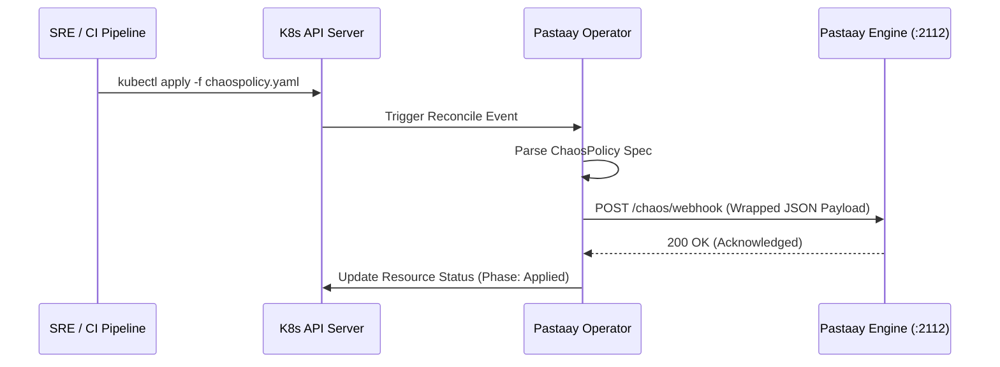

<p align="center">
  
</p>

# Pastaay Kubernetes Operator

The **Pastaay Kubernetes Operator** extends the Kubernetes API by introducing the `ChaosPolicy` Custom Resource Definition (CRD). It acts as an autonomous bridge between the Kubernetes Control Plane and the Pastaay Chaos Engine, enabling DevOps and SRE teams to orchestrate chaos experiments using native Kubernetes manifests and GitOps workflows (e.g., ArgoCD, Flux).

---

## 1. Architectural Overview

Pastaay is built with a decoupled architecture. The core Chaos Engine operates directly alongside your application datastores and message brokers, while the **Pastaay Operator** lives in the Kubernetes control plane.

The Operator utilizes the Kubernetes Controller-Runtime to constantly monitor the cluster for `ChaosPolicy` objects. Upon detection, it instantly translates the declarative Kubernetes YAML into Pastaay's proprietary JSON payload and injects it into the Engine's authenticated webhook.



---

## 2. The ChaosPolicy Custom Resource (CRD)

A `ChaosPolicy` allows you to define targeted fault injections declaratively.

### Anatomy of a ChaosPolicy

Below is an example of a policy designed to inject a 50% error rate into any global SQL database connection:

```yaml
apiVersion: chaos.pastaay.io/v1
kind: ChaosPolicy
metadata:
  name: k8s-db-attack
  namespace: default
spec:
  type: sql
  target: database
  errorChance: 0.5
  errorBody: "K8s Operator Injected Error"
```

### Supported Specification Fields

| Field | Type | Description |
| --- | --- | --- |
| `type` | **Required** | The protocol to target (`http`, `sql`, `grpc`, `redis`, `mongo`, `kafka`, `rabbitmq`, `resource`). |
| `target` | **Required** | The specific endpoint, query, or topic to target. Use `"all"` for global scope. |
| `latencyChance` | Optional | Float (0.0 to 1.0). Probability of introducing a delay. |
| `latencyDuration` | Optional | Go time duration string (e.g., `"500ms"`, `"2s"`). |
| `errorChance` | Optional | Float (0.0 to 1.0). Probability of injecting a synthetic error. |
| `errorCode` | Optional | Integer. Custom status code for HTTP or gRPC (e.g., `503`, `14`). |
| `errorBody` | Optional | String. Custom payload returned during an error. |
| `dropConnection` | Optional | Boolean. Forcefully severs the TCP connection (Supported by specific drivers). |

---

## 3. Installation & Deployment

The operator requires a running Kubernetes cluster (v1.11.3+) and the `kubectl` CLI.

### Step 3.1: Install the CRDs

First, register the `ChaosPolicy` Custom Resource Definition with your cluster:

```bash
make install
```

### Step 3.2: Configure the Engine Endpoint

The Operator needs to know where the Pastaay Engine's webhook is located. This is managed via the `PASTAAY_ENGINE_URL` environment variable.

* **For Local Development (make run):**
  If your engine is running locally on port 2112:
```bash
export PASTAAY_ENGINE_URL="http://localhost:2112/chaos/webhook"
```


* **For In-Cluster Deployment:**
  By default, the operator falls back to `http://pastaay-engine.default.svc.cluster.local:2112/chaos/webhook`. If your engine is deployed in a different namespace or service, modify the deployment manifest (`config/manager/manager.yaml`) to inject the correct `PASTAAY_ENGINE_URL`.

### Step 3.3: Run the Operator

**To run locally (outside the cluster for debugging):**

```bash
make run
```

**To deploy inside the cluster:**
Build the docker image and push it to your registry, then deploy via Kustomize:

```bash
make docker-build docker-push IMG=<your-registry>/pastaay-operator:v1.0.0
make deploy IMG=<your-registry>/pastaay-operator:v1.0.0
```

---

## 4. Validating Chaos Execution

Once the operator is running, apply a policy to the cluster:

```bash
kubectl apply -f config/samples/chaos_v1_chaospolicy.yaml
```

Check the status of your policy. The Operator natively updates the status subresource to confirm successful synchronization with the Pastaay Engine.

```bash
kubectl get chaospolicy k8s-db-attack -o yaml
```

**Expected Output (Truncated):**

```yaml
status:
  lastAppliedTime: "2026-05-15T12:00:00Z"
  phase: Applied

```

If the phase reads `Applied`, the Engine has actively loaded the policy into memory. If the Engine is unreachable or rejects the payload due to validation rules, the Operator will backoff and retry seamlessly.

---

## 5. Security & Isolation

The Pastaay Operator strictly adheres to the Principle of Least Privilege:

* **Namespaced Execution:** The operator executes within the restricted `operator-system` namespace.
* **RBAC Boundaries:** The auto-generated Role-Based Access Control (`config/rbac`) ensures the controller only has permissions to `GET`, `LIST`, `WATCH`, and `UPDATE` its own `ChaosPolicy` resources. It does not require broad cluster-admin privileges to interact with your workload pods.

<br>

<p align="center">
  
</p>
