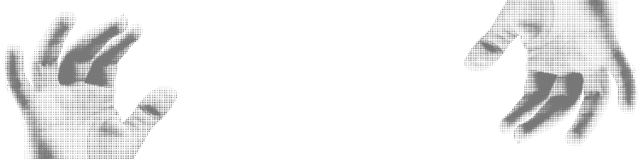

<p align="center">
  
</p>

Pastaay is designed to operate in highly distributed, Tier-1 enterprise environments. Relying solely on local `pastaay.yaml` file modifications is fundamentally incompatible with ephemeral infrastructure and massive Kubernetes fleets.

Pastaay utilizes **Remote Control Sensors** to decouple the engine from the disk, allowing you to inject, modify, or revoke chaos policies entirely in-memory across thousands of instances simultaneously.

To ensure strict engine integrity under external manipulation, every remote sensor is fortified with memory-bounded I/O streams, asynchronous telemetry, and a multi-phase validation guard.

---

## Authenticated HTTP Webhook (AWS FIS & CI/CD)

The webhook sensor exposes a dedicated HTTP endpoint to accept chaos policies on the fly. This is the primary integration point for CI/CD pipelines (e.g., GitHub Actions, GitLab CI) and Cloud Fault Injection tools like AWS FIS.

### Security & Memory Guards
Exposing an endpoint inherently introduces attack vectors. Pastaay mitigates these natively:
* **Timing Attack Prevention:** The authorization header is verified using `crypto/subtle.ConstantTimeCompare`, preventing attackers from guessing the token byte-by-byte via timing discrepancies.
* **OOM Exhaustion Shields:** The payload is processed through an `io.LimitReader` capped at 1MB. If a misconfigured pipeline or malicious actor blasts a 10GB payload, the engine drops the connection instantly before RAM allocation spikes.

### Integration
Extract your shared secret from a secure environment variable and wire it to the handler:

```go
import (
    "os"
    "net/http"
    "github.com/CemAkan/pastaay/pkg/config"
)

// Inside your main function or admin server setup:
adminMux := http.NewServeMux()
webhookToken := os.Getenv("PASTAAY_WEBHOOK_TOKEN")

adminMux.HandleFunc("/chaos/webhook", config.WebhookHandler(webhookToken, cfgManager.Update))
http.ListenAndServe(":2112", adminMux)

```

### Usage

Send a POST request with your YAML/JSON policy, passing the secret in the `X-Pastaay-Token` header:

```bash
curl -X POST -H "Content-Type: application/yaml" \
     -H "X-Pastaay-Token: <YOUR_SECRET_TOKEN>" \
     --data-binary @my-chaos-policy.yaml \
     http://localhost:2112/chaos/webhook

```

**JSON Acknowledgment (ACK):** The engine evaluates the payload synchronously and returns a detailed status.

```json
{
  "status": "success",
  "message": "Chaos policies applied"
}

```

---

## Redis PubSub

When manipulating the blast radius across hundreds of microservice replicas, addressing them individually via HTTP is inefficient. The Redis PubSub sensor allows you to broadcast a new memory state to your entire fleet in sub-milliseconds.

### Integration

```go
import "github.com/CemAkan/pastaay/pkg/config"

channel := "pastaay:chaos:policies"
err := config.WatchRedisPubSub(ctx, redisClient, channel, &wg, cfgManager)

```

### Usage & Asynchronous Telemetry

Publish the raw YAML string to the configured Redis channel:

```bash
redis-cli PUBLISH pastaay:chaos:policies "version: 1
policies:
  - name: 'db-kill-switch'
    type: 'sql'
    target: 'all'
    drop_connection: true"

```

**Asynchronous Feedback Loop (ACK):**
When an instance receives a PubSub command, it must report its status back to the control plane. However, waiting for network I/O during an ACK could block the subscription thread.

Pastaay solves this by utilizing a non-blocking `sync.WaitGroup` pattern with context-timed goroutines. Execution reports are published back to `<channel>:ack` (e.g., `pastaay:chaos:policies:ack`). This ensures the fleet-wide control loop is closed without introducing latency to the main configuration thread.

---

## Kubernetes ConfigMap Native Watcher

Integrating with Kubernetes usually means importing the massive `k8s.io/client-go` library, which adds 100+ MB of dependency bloat to a Go project.

Pastaay includes a **Zero-Bloat** Kubernetes watcher. It natively negotiates with the Kubernetes Downward API using the pod's injected service account token (`/var/run/secrets/kubernetes.io/serviceaccount/token`), keeping the compiled binary incredibly lightweight.

### Integration

```go
import "github.com/CemAkan/pastaay/pkg/config"

// Polls the ConfigMap 'pastaay-config' every 10 seconds securely
configMapName := "pastaay-config"
configMapKey := "pastaay.yaml"
err := config.WatchK8sConfigMap(ctx, configMapName, configMapKey, 10*time.Second, cfgManager)
```

**Stream Decoding:** To parse potentially massive ConfigMaps without causing GC spikes, the watcher bypasses `io.ReadAll` entirely. It streams the TCP response directly into the JSON decoder using a 5MB bounded reader.

### Usage

When you apply a change via `kubectl edit configmap pastaay-config`, the engine detects the `resourceVersion` mutation and executes an atomic memory hot-swap automatically.

---

## The Structural Validation Guard

Remote payloads bypass the safety of local development. While Pastaay allows unrestricted chaos testing without arbitrary execution limits, it maintains absolute engine stability by passing all incoming configurations through a strict **Multi-Phase Validation Guard** before mutating the `atomic.Pointer` memory.

The engine actively prevents self-corruption by scanning for structural anomalies:

* **Logical Integrity:** Rejects negative durations, negative memory chunks, and out-of-bounds probabilities.
* **Protocol Sanity:** Validates HTTP/gRPC status codes against protocol standards.
* **Regex Compilation:** Pre-compiles SQL target strings to ensure valid regex syntax.

**Error Aggregation & Atomic Rollbacks:**
Instead of failing at the first error, the engine aggregates all violations using Go 1.20+ `errors.Join`. If a payload contains *any* structural error, the engine rejects the update entirely, logs the multi-error violation, sends a failure ACK, and seamlessly continues operating with the last known stable configuration.

