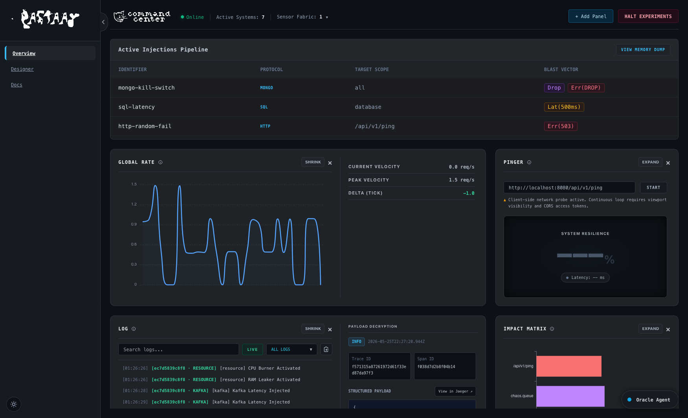
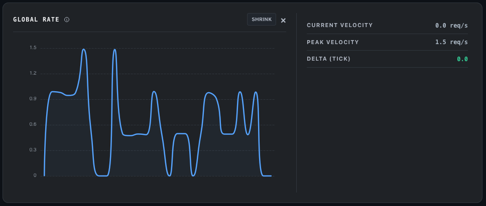
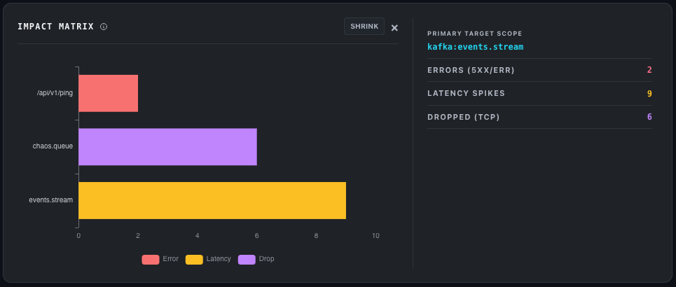
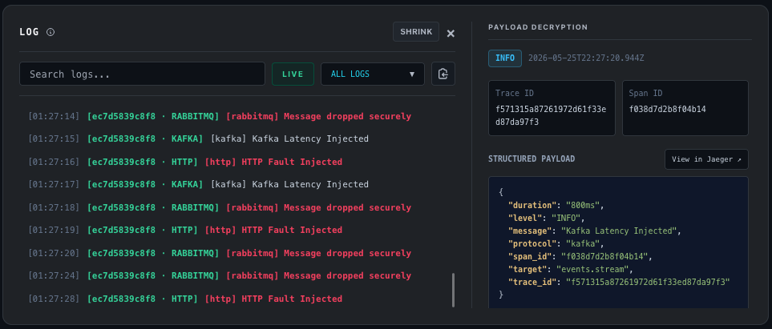
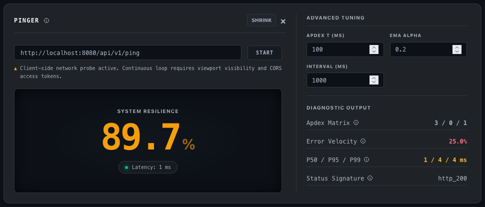
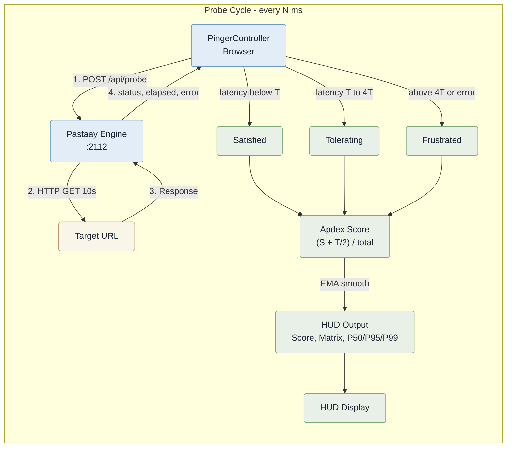
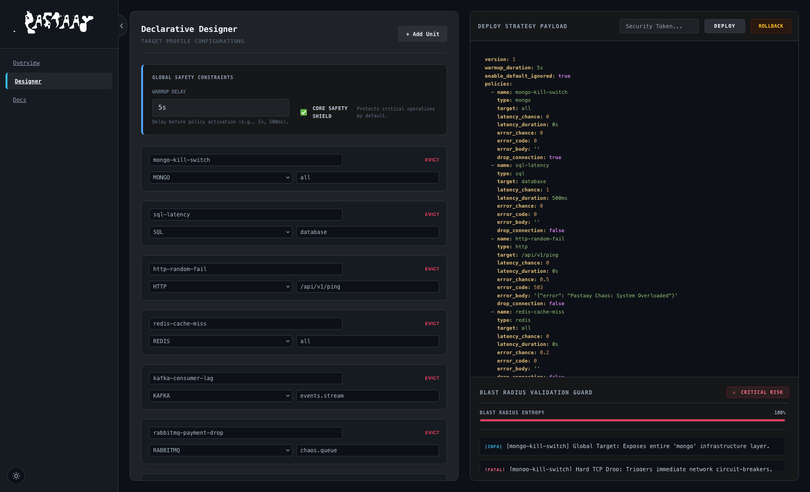
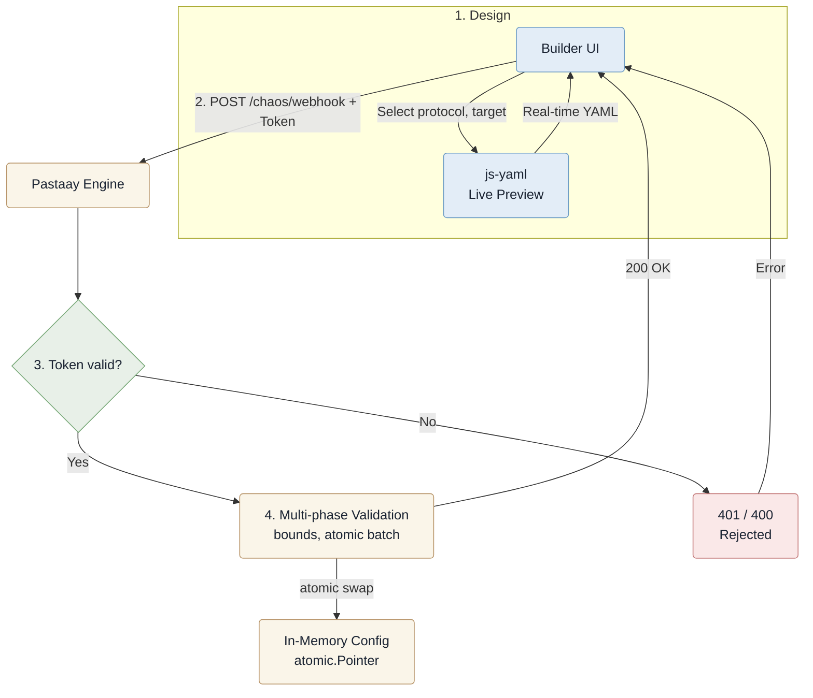
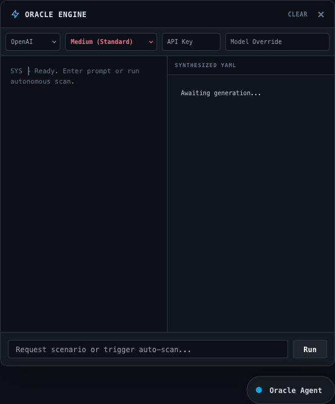

  

# The Web Console 

Pastaay features a built-in, air-gapped Web Console for real-time kinetic observability and rapid policy orchestration. Served directly from the engine's embedded filesystem at `:2112/console` -- zero external dependencies, no Node.js, no React. All documentation and diagrams are rendered from memory via `marked.js` and `mermaid.js`, version-locked to your engine release.

---

## 1. Dashboard & Telemetry Panels

  

The dashboard is a modular drag-and-drop grid. Add, remove, expand, or reorder panels via the `+ Add Panel` dropdown. Layout persists in `localStorage`.

**Engine Status Bar** -- Top bar showing live sensor count, active policy count, and an emergency `HALT EXPERIMENTS` button that clears all policies via `POST /api/rollback`.

 

### Global Fault Velocity

  

**Main:** Line chart of total fault injection rate (req/s) across all targets. 30-point sliding window, ECharts-powered. Reads `pastaay_injected_faults_total` from the engine's Prometheus `DefaultGatherer` at 2-second intervals.

**Details sidebar:** Current velocity (req/s), peak velocity, and tick delta with color-coded trend indicator.

 

### Blast Radius Matrix

  

**Main:** Stacked horizontal bar chart of the top 5 most-targeted services. Segments: errors (red), latency spikes (amber), dropped connections (purple). Same Prometheus data source as Fault Velocity.

**Details sidebar:** Primary target scope with exact counts for errors, latency spikes, and dropped TCP connections.

 

### System Output Journal

  

**Main:** Lock-free circular log viewer (600-line buffer, threshold eviction). Hierarchical filtering (Pod > Protocol > Method) via popover menu, text search, and live/pause toggle.

**Details sidebar (click any log line):** Structured payload decryption panel showing parsed JSON, Trace ID, Span ID, timestamp, and a **View in Jaeger** button when trace context is present.

 

### Resilience Probe

  

**Main:** Apdex-based health monitor. Large resilience score with color-coded EMA trend, latency indicator with pulse dot (green/amber/red), and multi-target URL input with START/STOP toggle.

**Details sidebar:** Advanced tuning controls (Apdex T threshold, EMA alpha smoothing factor, probe interval) plus diagnostic output fields (Apdex Matrix counts, Error Velocity percentage, P50/P95/P99 latency percentiles, Status Signature, Exception Output). Each field has an info popover. Full probe architecture in [section 2](#2-resilience-probe-apdex-monitor).

---

## 2. Resilience Probe (Apdex Monitor)

Continuously measures system health using the **Apdex (Application Performance Index)** methodology. Probes route through a **server-side proxy** to bypass browser CORS and capture real HTTP status codes.

`_probeOnce()` fires at configurable interval (default 1000ms), round-robin over comma-separated URLs. Protected by `_inflight` guard, viewport visibility pause, and AbortController with 5s timeout.

### Key Concepts

**Apdex (Application Performance Index):** An industry-standard metric for measuring user satisfaction with response times. Instead of a simple average, Apdex classifies each request into three buckets based on a threshold T:

| Bucket | Condition | Meaning |
|:---|:---|:---|
| **Satisfied** | Response time < T | User experienced fast, seamless service. |
| **Tolerating** | T <= response time < 4T | User noticed slowness but could complete their task. |
| **Frustrated** | Response time >= 4T, or error | User abandoned or couldn't complete their task. |

The Apdex score = (Satisfied + Tolerating/2) / Total * 100. A score of 100 means all requests were fast; 0 means all failed.

**EMA (Exponential Moving Average):** Smooths the Apdex score over time to filter out noise. A low alpha (0.05) reacts slowly -- good for stable systems. A high alpha (0.50) tracks rapid changes -- good during active chaos experiments.

**Fault Velocity:** The rate at which chaos faults are being injected, measured in requests per second. Spikes indicate your policies are actively hitting targets.

**Blast Radius:** The set of services affected by your chaos policies. The matrix shows which targets are taking the most damage across error, latency, and connection-drop dimensions.

### Diagnostic Output

| Field | What It Shows | How To Read It |
|:---|:---|:---|
| **Apdex Matrix** | `Satisfied / Tolerating / Frustrated` counts | Most probes should be Satisfied. Tolerating growing means latency is creeping up. Frustrated growing means the target is struggling or down. |
| **Error Velocity** | Percentage of probes in Frustrated | Near 0% = healthy. Sudden spikes = target failure or network issues. Consistently high = check target health. |
| **P50 / P95 / P99** | Latency at 50th, 95th, 99th percentile | P50 is typical latency. P95 shows worst-case for most users. P99 reveals tail latency -- if it's far from P50, you have inconsistency. |
| **Status Signature** | Last probe classification | `http_200` = OK. `http_500` = server error. `network` = can't connect. `timeout` = no response within deadline. |
| **Exception Output** | Error message from last failed probe | Empty when healthy. Shows the exact error (DNS failure, connection refused, TLS error) when something breaks. |

Each field has an info icon with a contextual popover. Adjustable thresholds: Apdex T (default 100ms), EMA alpha (0.20), probe interval (1000ms).

---

## 3. Visual Configurator (Builder)

Interactive GUI at `/console/builder` for designing chaos policies without writing YAML manually.

  

Select Protocol, Target, Error Chance, and Latency from dropdowns. `js-yaml` generates V1-compliant YAML in real-time. Deployment goes through `POST /chaos/webhook` with `X-Pastaay-Token`, verified via `ConstantTimeCompare`. Safety bounds enforced: latency <= 60s, RAM <= 4096MB. Invalid batches rejected atomically via `errors.Join`, preserving last-known-good config.

---

## 4. Oracle (AI SRE Copilot)

  

AI-powered assistant that analyzes live telemetry and generates chaos configurations from natural language prompts (e.g. "inject 500ms latency on /api/checkout for 30% of traffic").

**Flow:** Prompt + API key -> `POST /api/oracle` -> LLM (DeepSeek, Gemini, Claude, GPT) -> extracted YAML -> one-click deploy via `/chaos/webhook`.

Current engine config and Prometheus metrics are injected as context for context-aware suggestions. DEFCON intensity slider controls aggressiveness. Toggle the Oracle panel from the sidebar; requires a valid LLM API key.

---

## 5. API Reference

All endpoints under `/console/api/`. Authenticated endpoints require `X-Pastaay-Token` (verified via `ConstantTimeCompare`).

| Endpoint | Method | Auth | Description |
|:---|:---|:---|:---|
| `/console/api/state` | GET | Token | Engine state, active policies, sensor status, logs snapshot |
| `/console/api/metrics` | GET | No | Prometheus `pastaay_injected_faults_total` time-series |
| `/console/api/probe` | POST | Token | Server-side URL probe -- `{url}`, returns `{status, elapsed_ms, error}` |
| `/console/api/plan` | POST | Token | Validate YAML through the security guard linter |
| `/console/api/oracle` | POST | Token | AI SRE Copilot -- generate chaos configs from natural language |
| `/console/api/rollback` | POST | Token | Emergency abort -- clear all policies |
| `/console/api/discover` | GET | Token | List unique targets from Prometheus fault metrics |

 

  

